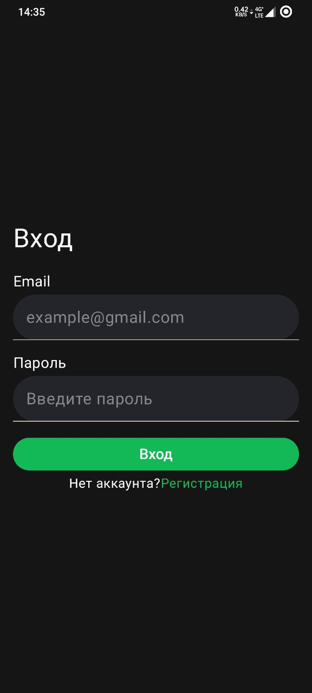

# Описание
Тестовое задание в виде приложения, которое отображает различные курсы с платформы Stepik.
Вход/регистрация по email.

Главный экран - список всех курсов (фильтрация по дате публикации и популярности).

Экран избранного - список курсов добавленных в избранное.

Экран пользователя - кнопка выхода из аккаунта, ниже расположены избранные курсы.

Также, при нажатии кнопки "перейти на пталформу" на экране курса, в браузере открывается ссылка курса на Stepik.

# Стек проекта
Kotlin, Jetpack Compose, Compose Navigation, Room, Firebase Auth, Retrofit, OkHttps, Koin, Coroutines, 

# Скриншоты приложения

  
Матрица Эйзенхауэра

